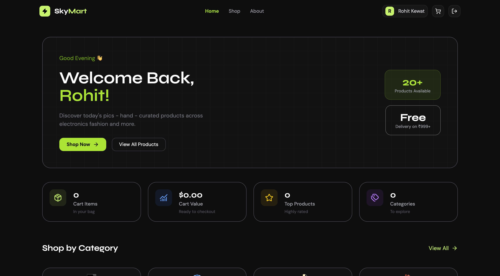

# 🛍️ SkyMart

A modern and responsive e-commerce frontend built with **React**, **Vite**, and **Tailwind CSS**. SkyMart focuses on delivering a clean shopping experience with reusable components, state management using Context API, and a scalable project structure.

> This project was built to strengthen my React fundamentals by implementing real-world e-commerce features and modern frontend development practices.

---

## 🚀 Live Demo

🔗 **Live Website:** https://cohort-3-react-tasks.vercel.app/

---

## 📸 Preview

> Add project screenshots here.

| Home Page | Product Details |
|-----------|-----------------|
|  |  |

---

# ✨ Features

- 🛒 Product Listing
- 🔍 Product Details Page
- ❤️ Wishlist Support
- 🛍️ Shopping Cart
- ➕ Add to Cart
- ➖ Increase / Decrease Quantity
- 🗑️ Remove Products from Cart
- 💰 Dynamic Cart Total Calculation
- 📱 Fully Responsive Design
- ⚡ Fast Performance with Vite
- 🎨 Modern UI using Tailwind CSS
- 🔄 Global State Management using React Context API
- 🔔 Toast Notifications
- ♻️ Reusable Components
- 🚦 Client-side Routing with React Router

---

# 🛠️ Tech Stack

### Frontend

- React.js
- Vite
- Tailwind CSS
- React Router
- Context API

### Libraries

- React Hot Toast
- Lucide React

---

# 📂 Project Structure

```
src/
│
├── assets/
│
├── components/
│   ├── Navbar
│   ├── Footer
│   ├── Hero
│   ├── ProductCard
│   ├── StatusCard
│   └── ...
│
├── context/
│   └── AppContext
│
├── pages/
│   ├── Home
│   ├── Cart
│   ├── Wishlist
│   └── ProductDetails
│
├── data/
│
├── utils/
│
├── App.jsx
└── main.jsx
```

---

# ⚙️ Installation

Clone the repository

```bash
git clone https://github.com/errohitkewat/cohort-3-react-tasks.git
```

Go to the project directory

```bash
cd cohort-3-react-tasks/react-task-1-skymart
```

Install dependencies

```bash
npm install
```

Start the development server

```bash
npm run dev
```

Build for production

```bash
npm run build
```

Preview production build

```bash
npm run preview
```

---

# 📖 What I Learned

While building SkyMart, I gained hands-on experience with:

- Building reusable React components
- Managing application state using Context API
- React Router for client-side navigation
- Component composition
- Conditional rendering
- Props and state management
- Responsive UI development with Tailwind CSS
- Organizing scalable React project structures
- Creating reusable UI patterns
- Improving overall code maintainability

---

# 🎯 Future Improvements

- User Authentication
- Backend Integration
- Product Search
- Product Filtering
- Product Sorting
- Checkout Flow
- Payment Gateway
- Persistent Cart using Database
- Order History
- Dark Mode
- Product Reviews & Ratings

---

# 🤝 Contributing

Contributions, issues, and feature requests are welcome.

Feel free to fork this repository and submit a pull request.

---

# 📄 License

This project is created for educational purposes.

---

# 👨‍💻 Author

**Rohit Kewat**

- GitHub: https://github.com/errohitkewat
- LinkedIn: https://www.linkedin.com/in/rohit-kewat-90b276347/

--- 

## ⭐ Support

If you found this project helpful, consider giving it a ⭐ on GitHub.
It helps motivate future improvements and supports my learning journey.